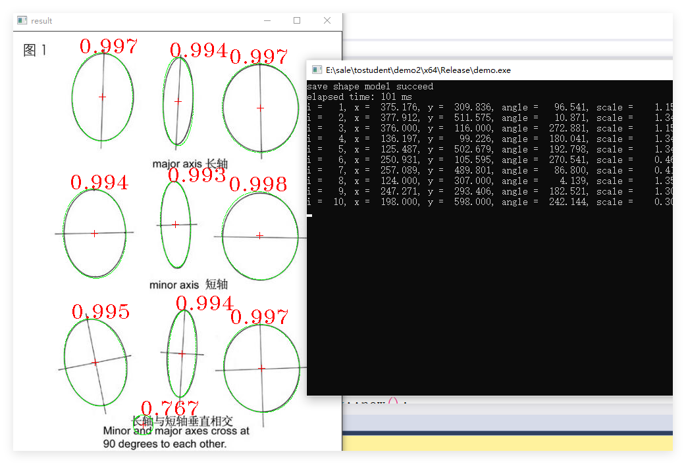

# mwwz-samples

## Build

1. Open it in Visual Studio 2017 or newer
2. Set the configuration manager to Release x64
3. Build and run the project
4. error MSB8036 : Right-click on the solution -> "Retarget solution"

## Usage

1. Shape-based-matching
2. Measuring
3. Region morphology

